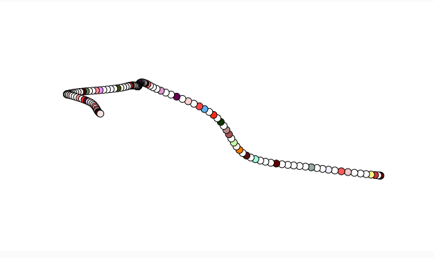

**Explica en tus propias palabras la figura 0.4: “A graph of Perlin noise values over time (left) and of random noise values over time (right)”** 

El de la izquierda la linea que produce es mas organizada y seguida, porque los numeros que se generan estan mas cerca al anterior. El de la derecha es con numeros aleatorios entonces es mas desorganizado y no seguido ya que no hay control de que el siguiente numero este mas o menos cerca al anterior.

**Explica cómo usaste el ruido Perlin para generar las variaciones.**

utilice el ruido Perlin para crear variaciones suaves en el movimiento de puntos en el canvas. El ruido genera unos valores que se transforman gradualmente, para que los cambios no sean bruscos. De esta manera, los movimientos de los puntos son más naturales y suaves, creando unas lineas que no cambian locamente. 
**El código.**

```
let xoff = 0; // Desplazamiento en el eje X para el ruido Perlin
let yoff = 1000; // Desplazamiento en el eje Y para el ruido Perlin

function setup() {
  createCanvas(640, 360);
  background(255);
}

function draw() {
  let x = noise(xoff) * width; // Generar valor de ruido Perlin para el eje X
  let y = noise(yoff) * height; // Generar valor de ruido Perlin para el eje Y
  
  fill(200);
  ellipse(x, y, 10, 10); // Dibujar un círculo en la posición generada

  // Incrementar los desplazamientos para generar variaciones a lo largo del tiempo
  xoff += 0.01;
  yoff += 0.01;
}
```

lo modifique para que los circulos cambien de color 

```
let xoff = 0; // Desplazamiento en el eje X para el ruido Perlin
let yoff = 1000; // Desplazamiento en el eje Y para el ruido Perlin
let colorsito = 10;

function setup() {
  colorMode(HSL,100,100,100);
  createCanvas(640, 360);
  background(255);
}

function draw() {
  
  // Generar color aleatorio
  let r = random(255); // Rojo
  let g = random(255); // Verde
  let b = random(255); // Azul
  
  let x = noise(xoff) * width; // Generar valor de ruido Perlin para el eje X
  let y = noise(yoff) * height; // Generar valor de ruido Perlin para el eje Y
  
    // Aplicar color de relleno
  fill(r, g, b);
  ellipse(x, y, 10, 10); // Dibujar un círculo en la posición generada

  // Incrementar los desplazamientos para generar variaciones a lo largo del tiempo
  xoff += 0.01;
  yoff += 0.01;
  
}
```

**Una captura de pantalla que muestre la visualización generada.**


