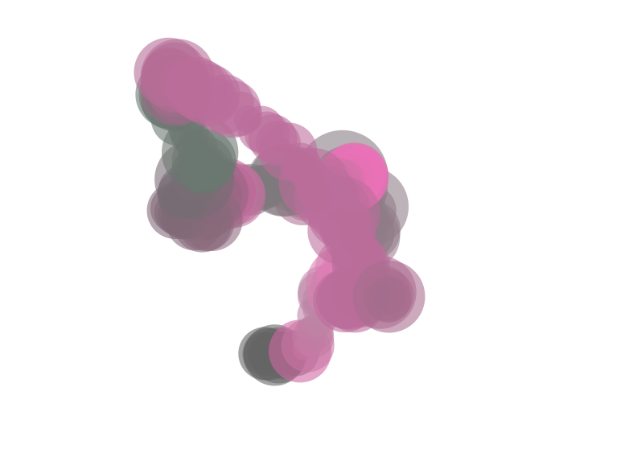
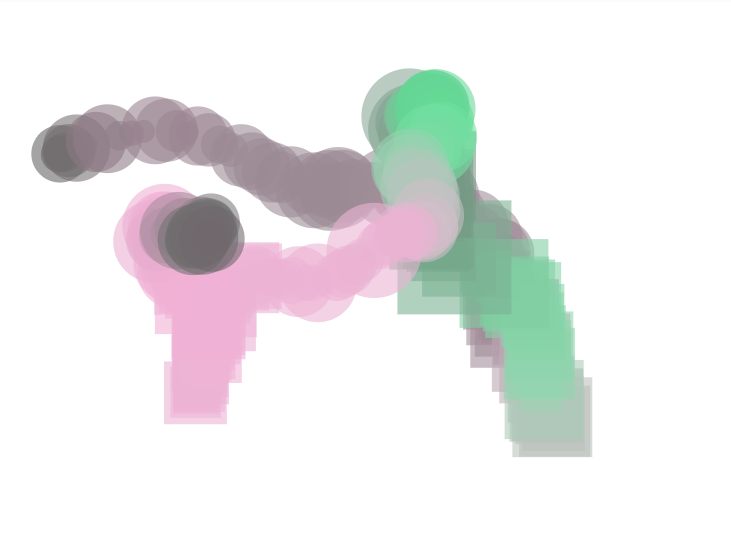

**Código de la aplicación.**

``` js
let xoff = 0; // Desplazamiento para el ruido Perlin (movimiento en X)
let yoff = 1000; // Desplazamiento para el ruido Perlin (movimiento en Y)

function setup() {
  createCanvas(800, 600);
  background(255);
}

function draw() {
  // Mover las figuras con ruido Perlin
  let x = noise(xoff) * width;  // Generar valor de ruido Perlin para la posición en X
  let y = noise(yoff) * height; // Generar valor de ruido Perlin para la posición en Y
  
  // Generar tamaños basados en distribución normal (tamaño más común alrededor de 50)
  let size = abs(randomGaussian(50, 20));

  // Cambiar colores según la posición del mouse
  let r = map(mouseX, 0, width, 100, 255);
  let g = map(mouseY, 0, height, 100, 255);
  let b = map(mouseX + mouseY, 0, width + height, 100, 255);

  // Dibujar la figura (círculos) con color cambiante
  fill(r, g, b, 150); // Color de relleno
  noStroke();
  ellipse(x, y, size, size); // Dibujar el círculo
  
  // Incrementar el desplazamiento del ruido Perlin
  xoff += 0.01;
  yoff += 0.01;
}
```

le cambie para que cuando hiciera clic izquierdo el circulo se convirtiera en un cuadrado y viceversa. 

``` js
let xoff = 0; // Desplazamiento para el ruido Perlin (movimiento en X)
let yoff = 1000; // Desplazamiento para el ruido Perlin (movimiento en Y)
let shapeType = 'circle'; // Variable para controlar la figura a dibujar

function setup() {
  createCanvas(800, 600);
  background(255);
}

function draw() {
  // Mover las figuras con ruido Perlin
  let x = noise(xoff) * width;  // Generar valor de ruido Perlin para la posición en X
  let y = noise(yoff) * height; // Generar valor de ruido Perlin para la posición en Y
  
  // Generar tamaños basados en distribución normal (tamaño más común alrededor de 50)
  let size = abs(randomGaussian(50, 20));

  // Cambiar colores según la posición del mouse
  let r = map(mouseX, 0, width, 100, 255);
  let g = map(mouseY, 0, height, 100, 255);
  let b = map(mouseX + mouseY, 0, width + height, 100, 255);

  // Dibujar la figura con el color cambiante
  fill(r, g, b, 150); // Color de relleno
  noStroke();

  // Dibujar la figura según el tipo (círculo o cuadrado)
  if (shapeType === 'circle') {
    ellipse(x, y, size, size); // Dibujar el círculo
  } else if (shapeType === 'square') {
    rect(x - size / 2, y - size / 2, size, size); // Dibujar el cuadrado
  }
  
  // Incrementar el desplazamiento del ruido Perlin
  xoff += 0.01;
  yoff += 0.01;
}

// Detectar el clic del mouse
function mousePressed() {
  // Cambiar la figura cuando se hace clic con el botón izquierdo
  if (mouseButton === LEFT) {
    if (shapeType === 'circle') {
      shapeType = 'square'; // Cambiar a cuadrado
    } else {
      shapeType = 'circle'; // Cambiar a círculo
    }
  }
}
```

**Captura del contenido generado.**





**En caso de realizar alguna variación al concepto original, escribe un texto donde expliques la razón del cambio.**

le cambie para que cuando hiciera clic izquierdo el circulo se convirtiera en un cuadrado y viceversa. Lo hice para que fuera un poco mas interesante. Tambien intente que el cambio de circulo a cuadrado fuera con una distribucion uniforme pero entonces no seria con el clic del mouse, y me gusto mas que fuera cuando uno hace clic.
