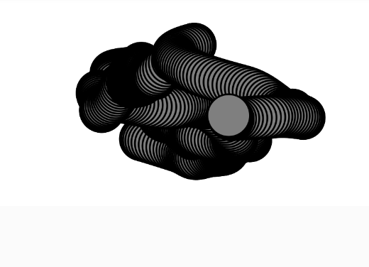

**¿Que tuviste que hacer para hacer la conversión propuesta?**

voy a modificar el walk de perlin noise.

hay que convertir los valores de la posicion en x y y en un vector. 

Tambien tuve que convertir el tiempo en un vector y cree tambien otro que sea lo que se le añade al tiempo. 

Estas fueron las lineas que cambie y añadi:

```
let position;
let tposition;

position = createVector(width / 2, height / 2); 
tposition = createVector(0, 10000);
time = createVector(0.01, 0.01);

position.x = map(noise(tposition.x), 0, 1, 0, width);
position.y = map(noise(tposition.y), 0, 1, 0, height);

tposition.add(time);
```

y asi quedaria todo el codigo para que sea con vectores:

```
// The Nature of Code
// Daniel Shiffman
// http://natureofcode.com

let walker;

let position;
let tposition;
let time;

function setup() {
  createCanvas(640, 240); // creating canvas of size 640 x 240
  walker = new Walker(); // creating an instance/object of class Walker
  background(255);
  
  position = createVector(width / 2, height / 2); 
  tposition = createVector(0, 10000);
  time = createVector(0.01, 0.01);
}

function draw() {
  walker.step();
  walker.show();
}

class Walker {
  constructor() {
    
  }

  step() {
    //{!2} x- and y-position mapped from noise
    position.x = map(noise(tposition.x), 0, 1, 0, width);
    position.y = map(noise(tposition.y), 0, 1, 0, height);

    //{!2} Move forward through “time.”
    tposition.add(time);
  }

  show() {
    strokeWeight(2);
    fill(127);
    stroke(0);
    circle(position.x, position.y, 48);
  }
}
```

y se ve asi:



