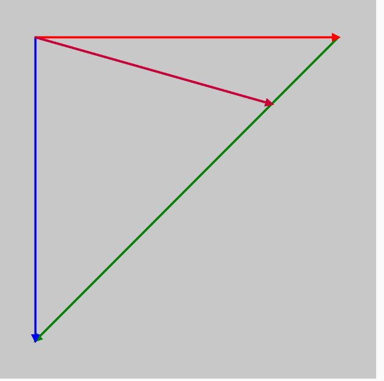

>Analiza cómo funciona el método lerp().
>Nota que además de la interpolación lineal de vectores, también puedes hacer interpolación lineal de colores con el método lerpColor().

El método lerp() (abreviatura de linear interpolation) realiza una interpolación lineal entre dos valores o, en el caso de vectores, entre dos puntos representados por vectores. La interpolación lineal permite calcular un valor intermedio en un porcentaje específico entre dos valores iniciales y finales.


- primero hice el canvas mas grande, de 500x500 y volvi las flechas mas largas
- hay que hacer que el valor 0.5 no sea fijo ```let v3 = p5.Vector.lerp(v1, v2, 0.5);```
- cree una variable que controla la interpolacion del vector morado ```let t = 0```
- y otra  ```let direction = 1```  que determina si t aumenta o disminuye, lo que permite que el vector morado se mueva hacia adelante y hacia atrás entre los vectores rojo y azul.
- ```let v3 = p5.Vector.lerp(v1, v2, t);``` se usa el método lerp() de interpolación lineal para calcular un punto entre los vectores rojo (v1) y azul (v2), controlado por la variable t. Cuando t es 0, v3 está completamente en la posición de v1 (rojo), y cuando t es 1, v3 está completamente en la posición de v2 (azul). A medida que t cambia de 0 a 1, v3 se mueve entre los dos vectores.
- y para crear el vector verde ```let connectingVector = p5.Vector.sub(v2, v1);``` use el método p5.Vector.sub() para restar v1 (rojo) de v2 (azul), creando un nuevo vector (connectingVector) que va desde la punta del vector rojo hasta la punta del vector azul. Este vector define la línea entre ambos.
```drawArrow(p5.Vector.add(v0, v1), connectingVector, 'green');``` y aqui uso la función drawArrow() para dibujar el vector verde entre las puntas. Uso p5.Vector.add(v0, v1) para obtener el punto de partida de este vector, y connectingVector como la dirección del vector.
- luego me di cuenta que habia que usar lerpColor para que el vector cambie de color segun al que se acerca. 
```let colorStart = color(255, 0, 0);``` El color inicial es rojo (RGB: 255, 0, 0).
```let colorEnd = color(0, 0, 255);``` El color final es azul (RGB: 0, 0, 255).
```let lerpedColor = lerpColor(colorStart, colorEnd, t);``` Usamos lerpColor() para interpolar entre el color rojo y azul, usando el valor t que ya controla el deslizamiento del vector morado. A medida que t cambia, el color del vector morado cambia entre rojo y azul.

sin que el vector cambie de color cuando se acerca al otro
```
let t = 0;  // Variable de tiempo para controlar la interpolación
let direction = 1;  // Dirección: 1 para avanzar, -1 para retroceder

function setup() {
    createCanvas(500, 500);
}

function draw() {
    background(200);

    let v0 = createVector(20, 20);  // Base en el centro del canvas
    let v1 = createVector(400, 0);   // Vector rojo
    let v2 = createVector(0, 400);   // Vector azul
    
    // Vector morado moviéndose en el tiempo entre v1 y v2
    let v3 = p5.Vector.lerp(v1, v2, t);
  
    // Vector que conecta las puntas de los vectores rojo y azul
    let connectingVector = p5.Vector.sub(v2, v1);
    
    // Dibujar el vector verde que conecta las puntas de los vectores rojo y azul
    drawArrow(p5.Vector.add(v0, v1), connectingVector, 'green');
    
    // Dibujar flechas
    drawArrow(v0, v1, 'red');
    drawArrow(v0, v2, 'blue');
    drawArrow(v0, v3, 'purple');
    
    // Incrementar o decrementar 't' según la dirección
    t += 0.01 * direction;
    
    // Cambiar la dirección cuando 't' llegue a los límites 0 o 1
    if (t >= 1 || t <= 0) {
        direction *= -1;
    }
}

function drawArrow(base, vec, myColor) {
    push();
    stroke(myColor);
    strokeWeight(3);
    fill(myColor);
    translate(base.x, base.y);
    line(0, 0, vec.x, vec.y);
    rotate(vec.heading());
    let arrowSize = 7;
    translate(vec.mag() - arrowSize, 0);
    triangle(0, arrowSize / 2, 0, -arrowSize / 2, arrowSize, 0);
    pop();
}
```


**El código que genera el resultado propuesto.**

``` js
let t = 0;
let direction = 1;

function setup() {
    createCanvas(500, 500);
}

function draw() {
    background(200);

    let v0 = createVector(50, 50);
    let v1 = createVector(400, 0);
    let v2 = createVector(0, 400);
    let v3 = p5.Vector.lerp(v1, v2, t);

    // Colores
    let colorStart = color(255, 0, 0); // Rojo
    let colorEnd = color(0, 0, 255);   // Azul
    let lerpedColor = lerpColor(colorStart, colorEnd, t); // Interpolación de color

    let connectingVector = p5.Vector.sub(v2, v1);
    drawArrow(p5.Vector.add(v0, v1), connectingVector, 'green'); // Dibuja el vector verde entre las puntas del rojo y azul
    drawArrow(v0, v1, 'red');   // Vector rojo
    drawArrow(v0, v2, 'blue');  // Vector azul
    drawArrow(v0, v3, lerpedColor); // Vector morado con interpolación de color

    // Actualización de t para mover el vector morado
    t += 0.01 * direction;
    if (t >= 1 || t <= 0) {
        direction *= -1;
    }
}

function drawArrow(base, vec, myColor) {
    push();
    stroke(myColor);
    strokeWeight(3);
    fill(myColor);
    translate(base.x, base.y);
    line(0, 0, vec.x, vec.y);
    rotate(vec.heading());
    let arrowSize = 7;
    translate(vec.mag() - arrowSize, 0);
    triangle(0, arrowSize / 2, 0, -arrowSize / 2, arrowSize, 0);
    pop();
}
```


**¿Cómo funciona lerp() y lerpColor().**

lerp() es una función de interpolación lineal que toma tres argumentos: dos valores (pueden ser números, vectores, etc.) y un valor de interpolación que va de 0 a 1. Interpola entre esos dos valores según el valor de interpolación proporcionado.

lerpColor() funciona de manera similar, pero está diseñada para interpolar entre colores.


**¿Cómo se dibuja una flecha usando drawArrow()?**

drawArrow() es una función que dibuja una flecha (línea con una punta) en el canvas. Toma tres parámetros:

- base: El punto de origen de la flecha (vector desde donde empieza la flecha).
- vec: El vector que indica la dirección y la longitud de la flecha.
- myColor: El color de la flecha.

Dentro de drawArrow(), usamos las siguientes transformaciones para colocar y orientar las flechas:

- translate(base.x, base.y): Establece el punto de origen de la flecha (el punto de partida).
- line(0, 0, vec.x, vec.y): Dibuja la línea desde (0, 0) al punto (vec.x, vec.y) (la longitud del vector).
- rotate(vec.heading()): Rota el sistema de coordenadas para que la flecha apunte en la dirección del vector.
- translate(vec.mag() - arrowSize, 0): Mueve el sistema de coordenadas al final del vector (donde debe ir la punta de la flecha).
- triangle(0, arrowSize / 2, 0, -arrowSize / 2, arrowSize, 0): Dibuja un triángulo que representa la punta de la flecha.



