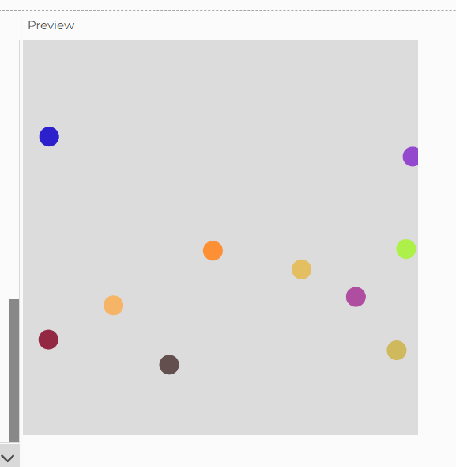

**¿En qué consiste motion 101?**

Es una explicacion de como hacer movimiento con vectores. 

Dice que los pasos son:
- sumar la velocidad a la posicion
- dibujar la posicion

El marco se puede entender con una ecuación básica: Posición = Posición + Velocidad

**Ejemplo**

un ejemplo muy basico seria una bolita que se mueve por la pantalla y se choca con las paredes.

```js
let position;
let velocity;

function setup() {
  createCanvas(400, 400);
  // Inicializamos la posición y la velocidad de la bola
  position = createVector(width / 2, height / 2);
  velocity = createVector(2, 3);  // La bola se moverá a la derecha y hacia abajo
}

function draw() {
  background(220);

  // Actualizamos la posición sumando la velocidad a la posición actual
  position.add(velocity);

  // Dibujamos la bola en su nueva posición
  ellipse(position.x, position.y, 20, 20);

  // Si la bola toca los bordes de la pantalla, invertimos su dirección
  if (position.x > width || position.x < 0) {
    velocity.x *= -1;
  }
  if (position.y > height || position.y < 0) {
    velocity.y *= -1;
  }
}
```

aqui lo hice un poco mas chevere, con mas circulos y que cuando choquen con los bordes cambien de color 

```js
let particles = []; // Arreglo para almacenar las partículas

function setup() {
  createCanvas(400, 400);
  
  // Crear varias partículas
  for (let i = 0; i < 10; i++) {
    particles.push(new Particle(random(width), random(height))); // Crear partículas con posiciones aleatorias
  }
}

function draw() {
  background(220);

  // Actualizar y dibujar todas las partículas
  for (let p of particles) {
    p.update();
    p.show();
  }
}

class Particle {
  constructor(x, y) {
    this.position = createVector(x, y);
    this.velocity = createVector(random(-2, 2), random(-2, 2)); // Velocidad aleatoria
    this.color = color(random(255), random(255), random(255)); // Color aleatorio inicial
  }

  update() {
    // Actualizar la posición
    this.position.add(this.velocity);

    // Comprobar si la partícula toca los bordes
    if (this.position.x > width || this.position.x < 0) {
      this.velocity.x *= -1;  // Invertir la dirección horizontal
      this.changeColor();     // Cambiar el color
    }
    if (this.position.y > height || this.position.y < 0) {
      this.velocity.y *= -1;  // Invertir la dirección vertical
      this.changeColor();     // Cambiar el color
    }
  }

  show() {
    // Dibujar la partícula como un círculo
    noStroke();
    fill(this.color);
    ellipse(this.position.x, this.position.y, 20, 20);
  }

  // Función para cambiar el color de la partícula
  changeColor() {
    this.color = color(random(255), random(255), random(255));  // Color aleatorio
  }
}
```



