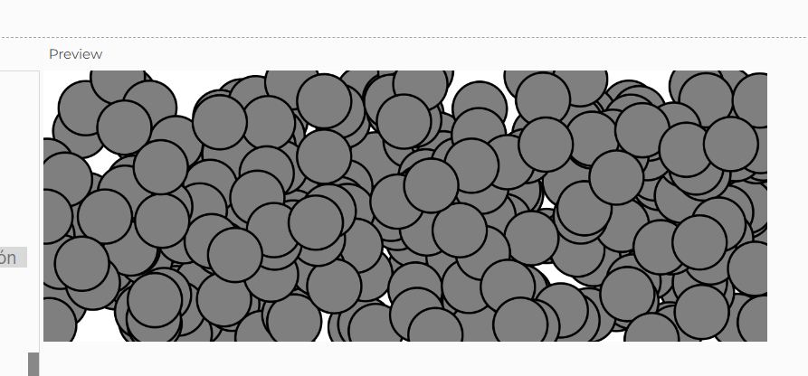

**Entiende el ejemplo.**
**Vas a proponer una modificación mediante esta pregunta que te harás: ¿Qué pasa si…?**

Que pasa si cada vez que se choca con el borde y vuelve a salir, sale una bolita mas.

**¿Qué te imaginas que pasará?**

se va a llenar el canvas de bolitas

**¿Qué pasó?**

se lleno el canvas de bolitas 

**¿Por qué?**

porque entre mas hay, mas tocan los bordes entonces mas se generan.

Esto ocurrió porque, en el código modificado, cuando una bolita toca los bordes del lienzo, se asigna una nueva posición aleatoria a esa bolita y se agrega una nueva bolita al arreglo movers. Esto genera un incremento continuo de bolitas en el lienzo

**Concluye**

Se puede hacer el Motion 101 con arreglos. Y se pueden usar para generar patrones visuales interesantes que se ven bacanos.

**codigo**

```js
let movers = []; // Arreglo para almacenar las bolitas

function setup() {
  createCanvas(640, 240);
  // Crear la primera bolita
  movers.push(new Mover());
}

function draw() {
  background(255);
  
  // Llamar a los métodos de cada bolita en el arreglo
  for (let mover of movers) {
    mover.update();
    mover.checkEdges();
    mover.show();
  }
}

class Mover {
  constructor() {
    // La bolita tiene dos vectores: posición y velocidad
    this.position = createVector(random(width), random(height));
    this.velocity = createVector(random(-2, 2), random(-2, 2));
  }

  update() {
    // Actualizar la posición sumando la velocidad
    this.position.add(this.velocity);
  }

  show() {
    // Dibujar la bolita en su posición actual
    stroke(0);
    strokeWeight(2);
    fill(127);
    circle(this.position.x, this.position.y, 48);
  }

  checkEdges() {
    // Comprobar si la bolita toca los bordes de la pantalla
    if (this.position.x > width || this.position.x < 0) {
      this.position.x = random(width);  // Volver a aparecer en una posición aleatoria
      movers.push(new Mover());  // Agregar una nueva bolita
    }

    if (this.position.y > height || this.position.y < 0) {
      this.position.y = random(height);  // Volver a aparecer en una posición aleatoria
      movers.push(new Mover());  // Agregar una nueva bolita
    }
  }
}
```

