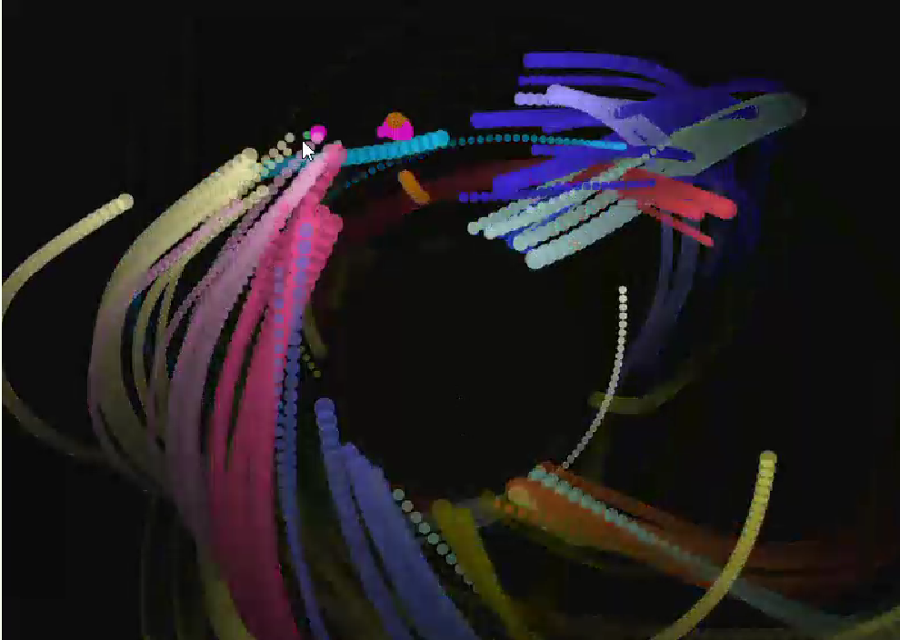

**Código de la aplicación.**

```js
let particles = [];
let particleColor;
let circleX, circleY, circleRadius;

function setup() {
  createCanvas(windowWidth, windowHeight);
  frameRate(60);
  particleColor = color(255, 100, 100); // Color inicial de las partículas (rojo claro)

  // Posición y tamaño del círculo invisible
  circleX = width / 2;
  circleY = height / 2;
  circleRadius = 100; // Radio del círculo (más pequeño)
}

function draw() {
  background(0, 10);

  // Crear nuevas partículas solo si el mouse no está dentro del círculo
  if (dist(mouseX, mouseY, circleX, circleY) > circleRadius) {
    let p = new Particle(mouseX, mouseY);
    particles.push(p);
  }

  // Dibujar el círculo invisible (sin borde)
  noFill();
  // stroke(255, 50); // Eliminar o comentar esta línea para que no se vea el borde del círculo
  ellipse(circleX, circleY, circleRadius * 2, circleRadius * 2);

  // Actualizar y mostrar todas las partículas
  for (let i = particles.length - 1; i >= 0; i--) {
    let particle = particles[i];

    // Verificar si la partícula está dentro del círculo
    if (dist(particle.position.x, particle.position.y, circleX, circleY) > circleRadius) {
      particle.update();
      particle.show();
    }

    if (particle.isFinished()) {
      particles.splice(i, 1);
    }
  }
}

class Particle {
  constructor(x, y) {
    this.position = createVector(x, y);
    this.velocity = createVector(random(-1, 1), random(-1, 1));
    this.acceleration = createVector(0, 0);
    this.size = random(5, 15);
    this.lifetime = 255;
    this.color = particleColor;  // Usar el color global para todas las partículas
  }

  update() {
    let mouse = createVector(mouseX, mouseY);
    let force = p5.Vector.sub(mouse, this.position);
    force.limit(0.2);
    this.acceleration = force;

    this.velocity.add(this.acceleration);
    this.position.add(this.velocity);
    this.lifetime -= 1;
  }

  show() {
    noStroke();
    fill(this.color.levels[0], this.color.levels[1], this.color.levels[2], this.lifetime);
    ellipse(this.position.x, this.position.y, this.size, this.size);
  }

  isFinished() {
    return this.lifetime <= 0;
  }
}

function mousePressed() {
  // Cambiar el color de todas las partículas al hacer clic
  particleColor = color(random(255), random(255), random(255));  // Color aleatorio
}
```

**Captura del contenido generado.**



**En caso de realizar alguna variación al concepto original, escribe un texto donde expliques la razón del cambio.**
