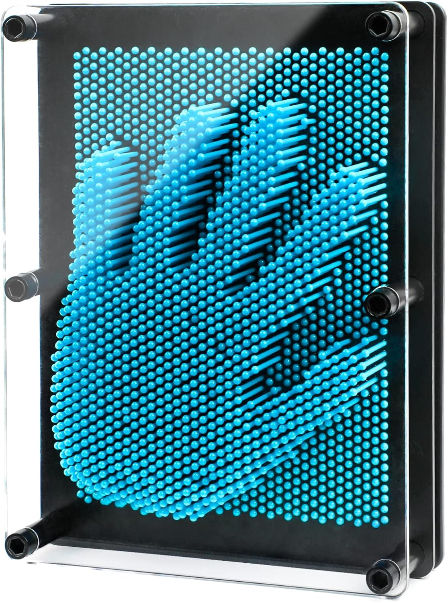

**un texto donde propongas para idea concreta asociado a tus intereses cómo difuminar la línea entre lo digital y lo tangible, ofreciendo experiencias inmersivas que involucren al espectador de manera multisensorial.**

se me ocurre como una superficie que proyecte pinturas o pues obras de arte y que cambie como el relieve de la superficie segun la pintura mostrada. 

donde una superficie compuesta por pequeños cilindros móviles cambia su relieve en tiempo real según la obra de arte proyectada. A medida que los pines suben y bajan, un proyector emite colores y formas sobre la superficie, creando una experiencia tridimensional y multisensorial en la que el arte cobra vida. Los espectadores pueden interactuar seleccionando las pinturas que desean visualizar y tocando el relieve, sintiendo físicamente las variaciones texturales que representan la obra proyectada, todo mientras los colores y las sombras se adaptan al movimiento, creando una experiencia visual y táctil inmersiva.

pensando como en este juguete 

