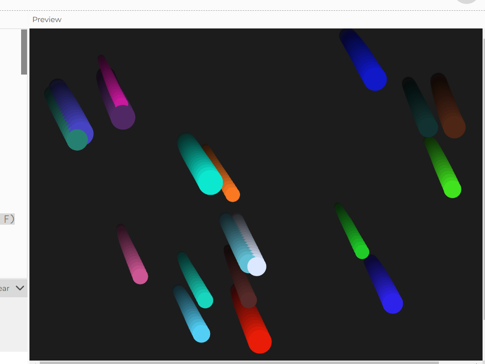

**¿Qué problema le ves a este planteamiento? ¿Qué solución propones? ¿Cómo lo implementarías en p5.js?**

el problema es que en el método applyForce(force) sobrescribe el valor de la aceleración en lugar de sumarlo a la aceleración existente. entonces no se esta haciendo sumatoria de fuerzas y la aceleracion que da no es la correcta.

Si solo se asigna this.acceleration = force, se esta ignorando las fuerzas que ya se han aplicado previamente en los frames anteriores.

se tendria que sumar en vez de solo ser igual. 

```js
// Método para aplicar una fuerza al objeto
  applyForce(force) {
    // Suma la fuerza a la aceleración existente
    this.acceleration.add(force);
  }
```

lo implementaria asi


```js
class Mover {
  constructor(x, y) {
    this.position = createVector(x, y);
    this.velocity = createVector(0, 0);
    this.acceleration = createVector(0, 0);
    // Podemos hacer masa = 1 como sugeriste, ¡el artista manda!
    this.mass = 1;
    
    // Añadimos algunas propiedades artísticas
    this.color = color(random(255), random(255), random(255));
    this.size = random(10, 30);
  }

  // Aquí es donde acumulamos las fuerzas
  applyForce(force) {
    // Sumamos la fuerza a la aceleración (F = ma, si m = 1, entonces a = F)
    this.acceleration.add(force);
  }

  update() {
    // Actualizamos velocidad y posición
    this.velocity.add(this.acceleration);
    this.position.add(this.velocity);
    
    // Importante: reiniciamos la aceleración para el siguiente frame
    this.acceleration.mult(0);
    
    // Añadimos límites al canvas para efecto visual
    this.checkEdges();
  }

  // Método artístico para visualizar el movimiento
  display() {
    noStroke();
    // El color varía según la velocidad
    let speed = this.velocity.mag();
    this.color.setAlpha(map(speed, 0, 5, 50, 255));
    fill(this.color);
    
    // El tamaño puede variar según la velocidad
    let currentSize = this.size + speed * 2;
    ellipse(this.position.x, this.position.y, currentSize);
    
    // Opcional: añadir trail
    stroke(this.color);
    line(
      this.position.x,
      this.position.y,
      this.position.x - this.velocity.x * 2,
      this.position.y - this.velocity.y * 2
    );
  }

  checkEdges() {
    if (this.position.x > width) {
      this.position.x = width;
      this.velocity.x *= -0.9; // Rebote con pérdida de energía
    } else if (this.position.x < 0) {
      this.position.x = 0;
      this.velocity.x *= -0.9;
    }
    
    if (this.position.y > height) {
      this.position.y = height;
      this.velocity.y *= -0.9;
    } else if (this.position.y < 0) {
      this.position.y = 0;
      this.velocity.y *= -0.9;
    }
  }
}

// Sketch principal
let movers = [];
let wind;
let gravity;

function setup() {
  createCanvas(800, 600);
  
  // Crear varios movers para efecto visual
  for (let i = 0; i < 20; i++) {
    movers.push(new Mover(random(width), random(height)));
  }
  
  // Fuerzas base
  wind = createVector(0.1, 0);
  gravity = createVector(0, 0.2);
}

function draw() {
  background(0, 20); // Trail effect
  
  // Aplicar fuerzas y actualizar todos los movers
  movers.forEach(mover => {
    // Aplicamos las fuerzas base
    mover.applyForce(wind);
    mover.applyForce(gravity);
    
    // Fuerza aleatoria para efecto artístico
    let noise = createVector(
      random(-0.1, 0.1),
      random(-0.1, 0.1)
    );
    mover.applyForce(noise);
    
    mover.update();
    mover.display();
  });
}

// Interactividad: click añade una fuerza de explosión
function mousePressed() {
  movers.forEach(mover => {
    let force = p5.Vector.sub(mover.position, createVector(mouseX, mouseY));
    force.normalize();
    force.mult(2);
    mover.applyForce(force);
  });
}
```
que hace que los circulito se caigan y reboten



