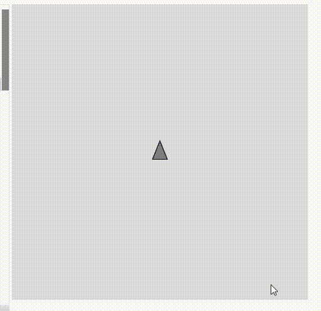

**Enlace a la simulación en el editor de p5.js.**

https://editor.p5js.org/salome2607/full/blPkrhlGc 

**Código de la simulación.**

```js
let vehicle;

function setup() {
  createCanvas(400, 400);
  vehicle = new Vehicle(width / 2, height / 2);  // Inicializar el vehículo en el centro
}

function draw() {
  background(220);
  
  vehicle.update();
  vehicle.display();
}

class Vehicle {
  constructor(x, y) {
    this.position = createVector(x, y);
    this.velocity = createVector(0, 0);
    this.acceleration = createVector(0, 0);
    this.maxSpeed = 4;
    this.heading = 0;  // Dirección del vehículo
  }
  
  applyForce(force) {
    this.acceleration.add(force);
  }
  
  update() {
    this.handleInput();  // Maneja la entrada de las teclas

    this.velocity.add(this.acceleration);
    this.velocity.limit(this.maxSpeed);
    this.position.add(this.velocity);
    
    this.acceleration.mult(0);  // Reiniciar la aceleración después de cada frame

    // Si el vehículo sale de la pantalla, reaparece en el lado opuesto
    if (this.position.x > width) this.position.x = 0;
    if (this.position.x < 0) this.position.x = width;
    if (this.position.y > height) this.position.y = 0;
    if (this.position.y < 0) this.position.y = height;
  }
  
  handleInput() {
    if (keyIsDown(LEFT_ARROW)) {
      // Mover a la izquierda
      this.heading = -1.6;  // Apuntar hacia la izquierda
      let force = createVector(-0.1, 0);  // Fuerza hacia la izquierda
      this.applyForce(force);
    }
    
    if (keyIsDown(RIGHT_ARROW)) {
      // Mover a la derecha
      this.heading = 1.6;  // Apuntar hacia la derecha
      let force = createVector(0.1, 0);  // Fuerza hacia la derecha
      this.applyForce(force);
    }
  }
  
  display() {
    fill(127);
    stroke(0);
    
    push();
    translate(this.position.x, this.position.y);
    rotate(this.heading);
    
    // Dibujar un triángulo que representa al vehículo
    beginShape();
    vertex(0, -15);  // Punta del triángulo (frente del vehículo)
    vertex(-10, 10);  // Parte izquierda del triángulo
    vertex(10, 10);   // Parte derecha del triángulo
    endShape(CLOSE);
    
    pop();
  }
}
```

**Captura de pantalla de la simulación.**


