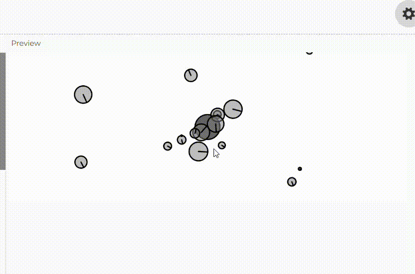

**Identifica motion 101. ¿Qué modificación hay que hacer al motion 101 cuando se quiere agregar fuerzas acumulativas? Trata de recordar por qué es necesario hacer esta modificación.**

El motion 101 se puede ver en la creacion de vectores de posicion, velocidad y aceleracion, esto se usa para poder simular el movimiento de un objeto. 

Si se quiere agregar fuerzas acumulativas entonces se debe agregar fuerzas de manera acumulativa y luego resetear la aceleración solo después de haber calculado su efecto.

Se resetea multiplicando por 0 la aceleracion para que no se acumule locamente, pero solo despues de acumular. 

```acceleration.mult(0);```

**Identifica dónde está el Attractor en la simulación. Cambia el color de este.**

El Attractor es un objeto en la simulación que atrae a otros objetos, simulando una fuerza de atracción (como la gravedad). 

Se le cambia el color modificandolo en la funcion display. 

```js
// Method to display
  display() {
    ellipseMode(CENTER);
    stroke(0);
    if (this.dragging) {
      fill(50);
    } else if (this.rollover) {
      fill(100);
    } else {
      fill(200, 0, 0);
    }
    ellipse(this.position.x, this.position.y, this.mass * 2);
  }
```
En fill se le cambian los valores, ahi lo cambie a que el atractor sea de color rojo.

**Observa que el Attractor tiene dos atributos this.dragging y this.rollover. Estos atributos no se modifican en el código, pero permitirían mover el attractor con el mouse y cambiar su color cuando el mouse está sobre él. ¿Cómo podrías modificar el código para que esto funcione? considera las funciones que ofrece p5.js para interactuar con el mouse.**

para que funcionara modifique el codigo agregando cuatro métodos nuevos para manejar la interacción con el mouse:
- checkHover(): Detecta si el mouse está sobre el atractor
- checkPress(): Detecta si se hizo clic en el atractor
- drag(): Mueve el atractor cuando se arrastra
- stopDragging(): Detiene el arrastre
- Un vector de desplazamiento (dragOffset) en el constructor para calcular la diferencia entre la posición del mouse y la del atractor cuando empieza el arrastre.
- Cuatro funciones de eventos de p5.js que deben colocarse fuera de la clase:
    - mouseMoved()
    - mousePressed()
    - mouseDragged()
    - mouseReleased()
 
- Cuando se mueve el mouse sobre el atractor, mouseMoved() llama a checkHover(), que calcula la distancia entre el mouse y el atractor, y actualiza this.rollover a true si está lo suficientemente cerca.
- Cuando se hace clic, mousePressed() llama a checkPress(), que verifica si esta haciendo clic en el atractor. Si es así, activa this.dragging y guarda la posición relativa para que el atractor no "salte" a la posición del cursor.
- Mientras se arrastra el mouse, mouseDragged() llama a drag(), que actualiza la posición del atractor si this.dragging es true.
- Cuando se suelta el botón, mouseReleased() llama a stopDragging(), que desactiva this.dragging.


