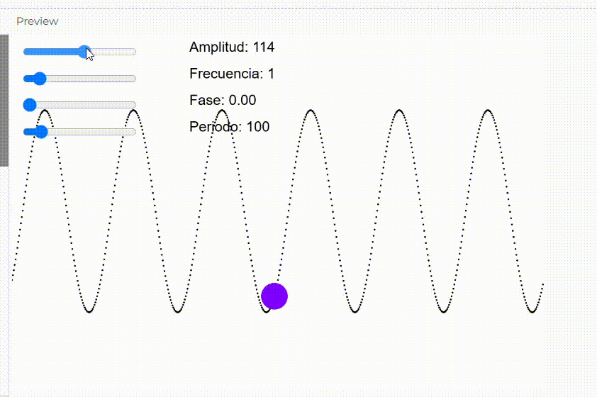

**Recuerda estos conceptos: velocidad angular, frecuencia, periodo, amplitud y fase.
Realiza una simulación en la que puedas modificar estos parámetros y observar cómo se comporta la función sinusoide.**

Velocidad angular: Se refiere a la velocidad con la que cambia el ángulo en un movimiento circular. En el contexto de una onda sinusoide, la velocidad angular determina la rapidez con la que oscila la función. Se expresa como 
ω=2πf, donde f es la frecuencia.

Frecuencia: Es el número de oscilaciones o ciclos que una onda completa en un segundo. Se mide en Hertz (Hz) y está relacionada con la velocidad angular por la fórmula 
ω=2πf. A mayor frecuencia, mayor es el número de oscilaciones por segundo.

Periodo: Es el tiempo que tarda una onda en completar un ciclo completo. Es inversamente proporcional a la frecuencia, es decir,  T= 1/f, donde T es el período y f es la frecuencia.

Amplitud: Es el valor máximo que alcanza la onda desde su posición de equilibrio. En una onda sinusoide, la amplitud controla la altura de las crestas y los valles.

Fase: Es el desplazamiento horizontal de la onda respecto a su posición de equilibrio. Un cambio en la fase de una onda adelanta o retrasa su ciclo en el tiempo.

**Enlace a la simulación en el editor de p5.js.**

https://editor.p5js.org/salome2607/full/Na-3qhoqR

**Código de la simulación.**

```
let amplitudeSlider, frequencySlider, phaseSlider, periodSlider;
let t = 0;
let xOffset = 0;

function setup() {
  createCanvas(600, 400);
  
  // Sliders para controlar la amplitud, frecuencia, fase y periodo
  amplitudeSlider = createSlider(10, 200, 100);
  amplitudeSlider.position(10, 10);
  
  frequencySlider = createSlider(0, 10, 1, 0.1);
  frequencySlider.position(10, 40);
  
  phaseSlider = createSlider(0, TWO_PI, 0, 0.01);
  phaseSlider.position(10, 70);
  
  periodSlider = createSlider(50, 500, 100);
  periodSlider.position(10, 100);
}

function draw() {
  background(255);
  
  let amplitude = amplitudeSlider.value(); // Amplitud
  let frequency = frequencySlider.value(); // Frecuencia
  let phase = phaseSlider.value();         // Fase
  let period = periodSlider.value();       // Periodo

  let wave = [];
  
  // Generar puntos de la onda sinusoide
  for (let x = 0; x < width; x++) {
    let angle = (TWO_PI * frequency * (x / period)) + phase;
    let y = amplitude * sin(angle + t);
    wave.push(createVector(x, height / 2 + y));
    
    // Dibujar la onda
    stroke(0);
    strokeWeight(2);
    point(x, height / 2 + y);
  }
  
  // Simulación del objeto moviéndose sobre la onda
  let x = xOffset % width; // El objeto se mueve de izquierda a derecha
  let angle = (TWO_PI * frequency * (x / period)) + phase;
  let y = amplitude * sin(angle + t);

  // Dibujar el objeto en el trayecto de la onda
  fill(127, 0, 255);
  noStroke();
  circle(x, height / 2 + y, 30); // El objeto que sigue la onda
  
  xOffset += 2; // Incremento para mover el objeto
  
  t += 0.02; // Incremento de tiempo para hacer oscilar la onda
  
  // Información visual en pantalla
  textSize(16);
  fill(0);
  noStroke();
  text("Amplitud: " + amplitude, 200, 20);
  text("Frecuencia: " + frequency, 200, 50);
  text("Fase: " + nf(phase, 1, 2), 200, 80);
  text("Periodo: " + period, 200, 110);
}
```

**Captura de pantalla de la simulación.**


