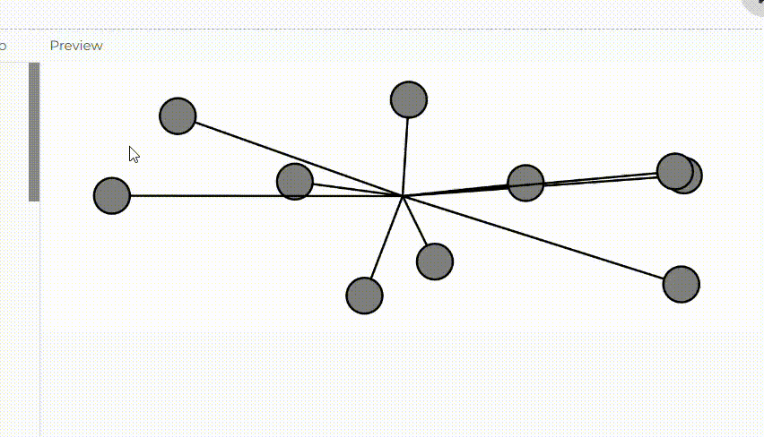

**Enlace a la simulación en el editor de p5.js.**

https://editor.p5js.org/salome2607/sketches/rdjkbJZoe

se aplica una fuerza aleatoria que simula el viento cuando se presiona el mouse.

**Código de la simulación.**

```js
// Array de objetos (osciladores)
let oscillators = [];
let windForce; // Variable para la fuerza del viento
let windActive = false; // Variable para activar/desactivar el viento

function setup() {
  createCanvas(640, 240);
  // Inicializamos los osciladores
  for (let i = 0; i < 10; i++) {
    oscillators.push(new Oscillator());
  }
}

function draw() {
  background(255);

  // Si el viento está activo (mouse presionado), aplicar fuerza de viento
  if (windActive) {
    for (let i = 0; i < oscillators.length; i++) {
      oscillators[i].applyForce(windForce);
    }
  }

  // Actualizamos y mostramos los osciladores (independientemente del viento)
  for (let i = 0; i < oscillators.length; i++) {
    oscillators[i].update();
    oscillators[i].show();
  }
}

// Detecta cuando se presiona el mouse
function mousePressed() {
  // Genera una fuerza de viento más suave
  windForce = createVector(random(-0.01, 0.01), random(-0.01, 0.01));
  windActive = true; // Activa el viento
}

// Detecta cuando se suelta el mouse
function mouseReleased() {
  windActive = false; // Desactiva el viento
}

class Oscillator {
  constructor() {
    this.angle = createVector();
    this.angleVelocity = createVector(random(-0.05, 0.05), random(-0.05, 0.05));
    this.amplitude = createVector(random(20, width / 2), random(20, height / 2));
    this.angleAcceleration = createVector(0, 0); // Aceleración angular
  }

  // Método para aplicar una fuerza externa
  applyForce(force) {
    this.angleAcceleration.add(force);
  }

  update() {
    // Incrementa la velocidad angular con la aceleración angular
    this.angleVelocity.add(this.angleAcceleration);
    // Actualiza el ángulo
    this.angle.add(this.angleVelocity);
    // Resetea la aceleración angular para evitar acumulación
    this.angleAcceleration.mult(0);
  }

  show() {
    let x = sin(this.angle.x) * this.amplitude.x;
    let y = sin(this.angle.y) * this.amplitude.y;

    push();
    translate(width / 2, height / 2);
    stroke(0);
    strokeWeight(2);
    fill(127);
    line(0, 0, x, y);
    circle(x, y, 32);
    pop();
  }
}
```

**Captura de pantalla de la simulación.**


