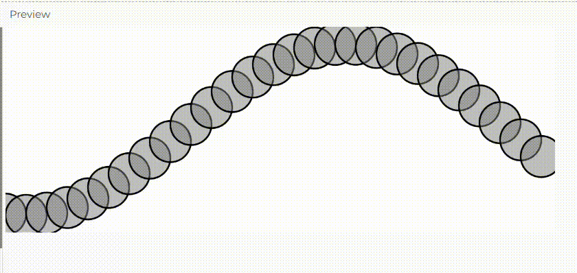

**Enlace a la simulación en el editor de p5.js.**

[https://editor.p5js.org/natureofcode/sketches/CQ19Yw0iT](https://editor.p5js.org/salome2607/sketches/WA2hDhcYp)

**Código de la simulación.**

```js
let angle = 0;
let angleVelocity = 0.2; // Velocidad angular
let amplitude = 100;     // Amplitud de la onda
let waveOffset = 0;      // Desplazamiento de la onda

function setup() {
  createCanvas(640, 240);
}

function draw() {
  background(255); // Limpiar la pantalla en cada frame
  
  stroke(0);
  strokeWeight(2);
  fill(127, 127);

  let currentAngle = waveOffset; // Desplazamiento inicial de la onda

  // Dibujar la onda como una serie de círculos
  for (let x = 0; x <= width; x += 24) {
    // 1) Calcular la posición en y de acuerdo a la amplitud y el seno del ángulo actual
    let y = amplitude * sin(currentAngle);
    // 2) Dibujar un círculo en la posición (x, y)
    circle(x, y + height / 2, 48);
    // 3) Incrementar el ángulo según la velocidad angular
    currentAngle += angleVelocity;
  }

  // Incrementar el desplazamiento de la onda en cada fotograma
  waveOffset += 0.05;
}
```

**Captura de pantalla de la simulación.**



