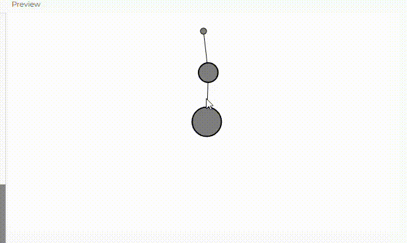

**Enlace a la simulación en el editor de p5.js.**

https://editor.p5js.org/salome2607/sketches/CHfiw5pHk

**Código de la simulación.**

```js
// Objetos para el sistema
let anchor1; // Punto de anclaje superior
let middleBob; // Objeto intermedio
let endBob; // Objeto final
// Resortes
let spring1; // Resorte superior
let spring2; // Resorte inferior

function setup() {
  createCanvas(640, 360);
  
  // Crear objetos en posiciones iniciales
  anchor1 = createVector(width / 2, 30);
  
  // Crear el primer resorte (desde el anclaje al objeto intermedio)
  spring1 = new Spring(anchor1.x, anchor1.y, 80);
  
  // Crear el objeto intermedio
  middleBob = new Bob(width / 2, 110, 16);
  
  // Crear el segundo resorte (desde el objeto intermedio al objeto final)
  spring2 = new Spring2(80); // Solo necesita longitud, posición se actualiza dinámicamente
  
  // Crear el objeto final
  endBob = new Bob(width / 2, 190, 24);
}

function draw() {
  background(255);
  
  // Aplicar gravedad a ambos objetos
  let gravity = createVector(0, 2);
  middleBob.applyForce(gravity.copy());
  endBob.applyForce(gravity.copy());
  
  // Actualizar la posición de los objetos
  middleBob.update();
  middleBob.handleDrag(mouseX, mouseY);
  endBob.update();
  endBob.handleDrag(mouseX, mouseY);
  
  // Conectar el primer resorte al objeto intermedio
  spring1.connect(middleBob);
  
  // Conectar el segundo resorte entre el objeto intermedio y el objeto final
  spring2.connect(middleBob, endBob);
  
  // Restringir la longitud de los resortes
  spring1.constrainLength(middleBob, 30, 150);
  spring2.constrainLength(middleBob, endBob, 30, 150);
  
  // Dibujar todo
  spring1.showLine(middleBob);
  spring2.showLine(middleBob, endBob);
  
  // Dibujar los objetos
  spring1.show();
  middleBob.show();
  endBob.show();
}

function mousePressed() {
  middleBob.handleClick(mouseX, mouseY);
  endBob.handleClick(mouseX, mouseY);
}

function mouseReleased() {
  middleBob.stopDragging();
  endBob.stopDragging();
}
class Spring {
  constructor(x, y, length) {
    this.anchor = createVector(x, y);
    this.restLength = length;
    this.k = 0.2;
  }
  
  // Calcular y aplicar la fuerza del resorte
  connect(bob) {
    // Vector desde el anclaje a la posición del objeto
    let force = p5.Vector.sub(bob.position, this.anchor);
    // Calcular la distancia
    let currentLength = force.mag();
    // El estiramiento es la diferencia entre la longitud actual y la longitud en reposo
    let stretch = currentLength - this.restLength;
    // Dirección y magnitud juntas
    force.setMag(-1 * this.k * stretch);
    // Aplicar la fuerza al objeto
    bob.applyForce(force);
  }
  
  constrainLength(bob, minlen, maxlen) {
    // Vector desde el objeto al anclaje
    let direction = p5.Vector.sub(bob.position, this.anchor);
    let length = direction.mag();
    // ¿Es demasiado corto?
    if (length < minlen) {
      direction.setMag(minlen);
      // Mantener la posición dentro de las restricciones
      bob.position = p5.Vector.add(this.anchor, direction);
      bob.velocity.mult(0);
    // ¿Es demasiado largo?
    } else if (length > maxlen) {
      direction.setMag(maxlen);
      // Mantener la posición dentro de las restricciones
      bob.position = p5.Vector.add(this.anchor, direction);
      bob.velocity.mult(0);
    }
  }
  
  // Dibujar el anclaje
  show() {
    fill(127);
    circle(this.anchor.x, this.anchor.y, 10);
  }
  
  // Dibujar la conexión del resorte
  showLine(bob) {
    stroke(0);
    strokeWeight(1);
    line(bob.position.x, bob.position.y, this.anchor.x, this.anchor.y);
  }
}

// Clase para el segundo resorte (entre dos objetos móviles)
class Spring2 {
  constructor(length) {
    this.restLength = length;
    this.k = 0.2;
  }
  
  // Calcular y aplicar la fuerza del resorte entre dos objetos
  connect(bob1, bob2) {
    // Vector desde el primer objeto al segundo
    let force = p5.Vector.sub(bob2.position, bob1.position);
    // Calcular la distancia
    let currentLength = force.mag();
    // El estiramiento es la diferencia entre la longitud actual y la longitud en reposo
    let stretch = currentLength - this.restLength;
    
    // Dirección y magnitud para la fuerza
    force.setMag(-1 * this.k * stretch);
    
    // Aplicar la fuerza al segundo objeto
    bob2.applyForce(force);
    
    // Aplicar la fuerza opuesta al primer objeto (acción y reacción)
    let oppositeForce = force.copy().mult(-1);
    bob1.applyForce(oppositeForce);
  }
  
  constrainLength(bob1, bob2, minlen, maxlen) {
    // Vector desde el primer objeto al segundo
    let direction = p5.Vector.sub(bob2.position, bob1.position);
    let length = direction.mag();
    
    // ¿Es demasiado corto?
    if (length < minlen) {
      direction.setMag(minlen);
      // Ajustar la posición del segundo objeto
      bob2.position = p5.Vector.add(bob1.position, direction);
      bob2.velocity.mult(0);
    // ¿Es demasiado largo?
    } else if (length > maxlen) {
      direction.setMag(maxlen);
      // Ajustar la posición del segundo objeto
      bob2.position = p5.Vector.add(bob1.position, direction);
      bob2.velocity.mult(0);
    }
  }
  
  // Dibujar la conexión del resorte
  showLine(bob1, bob2) {
    stroke(0);
    strokeWeight(1);
    line(bob1.position.x, bob1.position.y, bob2.position.x, bob2.position.y);
  }
}
class Bob {
  constructor(x, y, mass = 24) {
    this.position = createVector(x, y);
    this.velocity = createVector();
    this.acceleration = createVector();
    this.mass = mass;
    // Amortiguamiento arbitrario para simular fricción/resistencia
    this.damping = 0.98;
    // Para la interacción del usuario
    this.dragOffset = createVector();
    this.dragging = false;
  }
  
  // Integración estándar de Euler
  update() {
    if (!this.dragging) {
      this.velocity.add(this.acceleration);
      this.velocity.mult(this.damping);
      this.position.add(this.velocity);
    }
    this.acceleration.mult(0);
  }
  
  // Ley de Newton: F = M * A
  applyForce(force) {
    let f = force.copy();
    f.div(this.mass);
    this.acceleration.add(f);
  }
  
  // Dibujar el objeto
  show() {
    stroke(0);
    strokeWeight(2);
    fill(127);
    if (this.dragging) {
      fill(200);
    }
    circle(this.position.x, this.position.y, this.mass * 2);
  }
  
  handleClick(mx, my) {
    let d = dist(mx, my, this.position.x, this.position.y);
    if (d < this.mass) {
      this.dragging = true;
      this.dragOffset.x = this.position.x - mx;
      this.dragOffset.y = this.position.y - my;
    }
  }
  
  stopDragging() {
    this.dragging = false;
  }
  
  handleDrag(mx, my) {
    if (this.dragging) {
      this.position.x = mx + this.dragOffset.x;
      this.position.y = my + this.dragOffset.y;
    }
  }
}
```

**Captura de pantalla de la simulación.**


