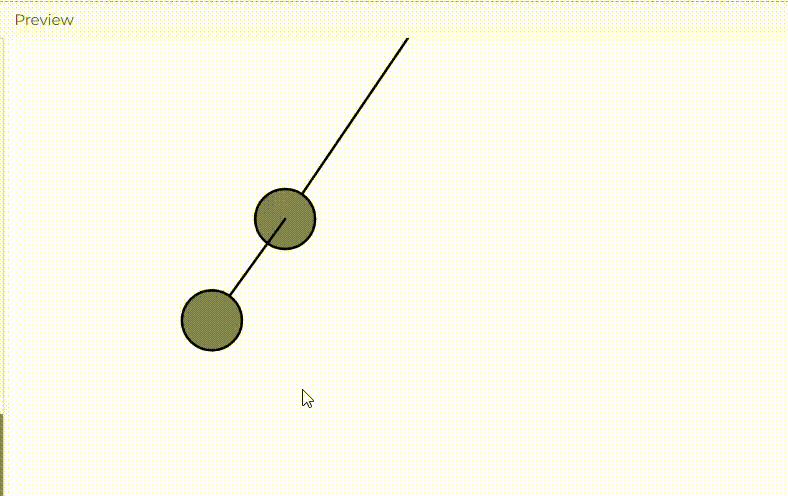

**Enlace a la simulación en el editor de p5.js.**

https://editor.p5js.org/salome2607/sketches/Vlpx1b0O3

**Código de la simulación.**

```js
let pendulum1;
let pendulum2;

function setup() {
  createCanvas(640, 600);
  // Crear el primer péndulo con una longitud de 175
  pendulum1 = new Pendulum(width / 2, 0, 175);
  // Crear el segundo péndulo con una longitud de 100, anclado al bob del primer péndulo
  pendulum2 = new Pendulum(pendulum1.bob.x, pendulum1.bob.y, 100);
}

function draw() {
  background(255);

  // Actualizar el primer péndulo
  pendulum1.update();
  pendulum1.show();

  // Establecer el origen del segundo péndulo en la posición del bob del primer péndulo
  pendulum2.setOrigin(pendulum1.bob.x, pendulum1.bob.y);
  pendulum2.update();
  pendulum2.show();

  // Interacción de arrastre para el primer péndulo
  pendulum1.drag();
}

function mousePressed() {
  // Verificar si el primer péndulo fue clicado
  pendulum1.clicked(mouseX, mouseY);
}

function mouseReleased() {
  // Detener el arrastre del primer péndulo
  pendulum1.stopDragging();
}
class Pendulum {
  constructor(x, y, r) {
    // Inicializar todas las variables
    this.pivot = createVector(x, y);
    this.bob = createVector();
    this.r = r;
    this.angle = PI / 4;

    this.angleVelocity = 0.0;
    this.angleAcceleration = 0.0;
    this.damping = 0.995; // Amortiguación arbitraria
    this.ballr = 24.0; // Radio de la bola
    this.dragging = false;
  }

  // Actualizar la posición del péndulo
  update() {
    if (!this.dragging) {
      let gravity = 0.4; // Constante de gravedad
      this.angleAcceleration = ((-1 * gravity) / this.r) * sin(this.angle);

      this.angleVelocity += this.angleAcceleration;
      this.angle += this.angleVelocity;

      this.angleVelocity *= this.damping; // Aplicar amortiguación
    }
  }

  show() {
    this.bob.set(this.r * sin(this.angle), this.r * cos(this.angle), 0); // Conversión de polar a cartesiano
    this.bob.add(this.pivot); // Asegurar que la posición sea relativa al origen

    stroke(0);
    strokeWeight(2);
    // Dibujar el brazo del péndulo
    line(this.pivot.x, this.pivot.y, this.bob.x, this.bob.y);
    fill(127);
    // Dibujar la bola del péndulo
    circle(this.bob.x, this.bob.y, this.ballr * 2);
  }

  // Establecer el nuevo origen para el segundo péndulo
  setOrigin(x, y) {
    this.pivot.set(x, y);
  }

  // Método para detectar si el péndulo fue clicado
  clicked(mx, my) {
    let d = dist(mx, my, this.bob.x, this.bob.y);
    if (d < this.ballr) {
      this.dragging = true;
    }
  }

  // Detener el arrastre
  stopDragging() {
    this.angleVelocity = 0; // Sin velocidad al soltar
    this.dragging = false;
  }

  // Lógica para arrastrar el péndulo
  drag() {
    if (this.dragging) {
      let diff = p5.Vector.sub(this.pivot, createVector(mouseX, mouseY)); // Diferencia entre dos puntos
      this.angle = atan2(-1 * diff.y, diff.x) - radians(90); // Ángulo relativo al eje vertical
    }
  }
}
```

**Captura de pantalla de la simulación.**


