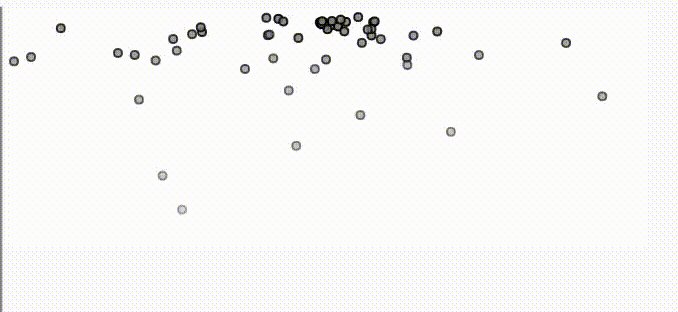
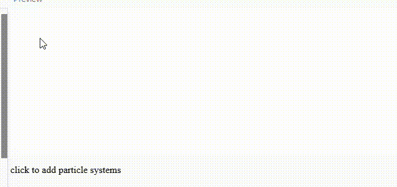
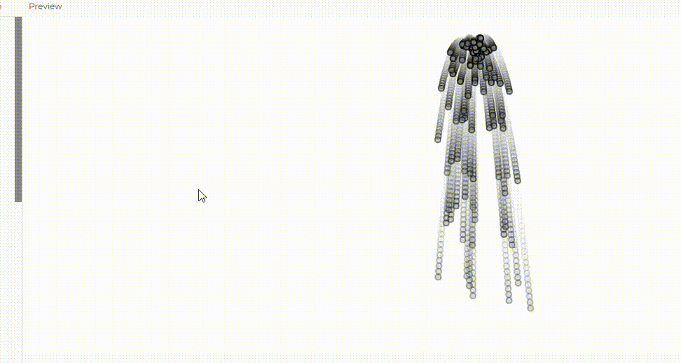
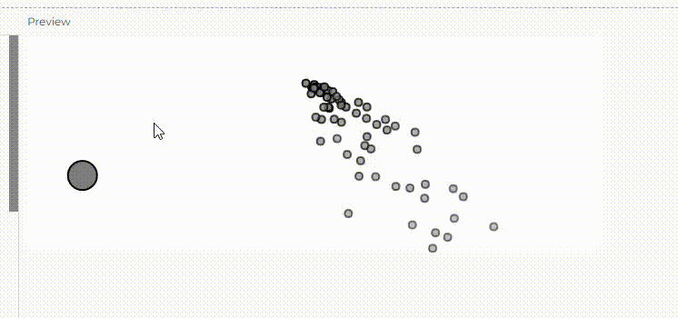

> ¿Cómo se está gestionando la creación y la desaparción de las partículas y cómo se gestiona la memoria en cada una de las simulaciones?
Vas a modificar cada una de las simulaciones anteriores incluyen en cada una, al menos un concepto de las unidades anteriores, pero no repitas concepto, la idea es que repases al menos uno de cada unidad.
Vas a gestionar la creación y la desaparición de las partículas y la memoria. Explica cómo lo hiciste.
> - Explica qué concepto aplicaste, cómo lo aplicaste y por qué.
> - Incluye un enlace a tu código en el editor de p5.js.
> - Incluye el código fuente de cada una de las simulaciones.
> - Captura de pantallas de cada una de las simulaciones con las imágenes que más te gusten como resultado de la ejecución de cada una de las simulaciones.


### **Simulacion #1**
**- ¿Cómo se está gestionando la creación y la desaparción de las partículas y cómo se gestiona la memoria en cada una de las simulaciones?**

se crea una matriz de partículas que se actualiza en cada cuadro del programa. Las partículas se agregan a la matriz cuando se crea una nueva y desaparecen cuando su vida útil llega a cero.
La eliminación de las partículas se realiza mediante la eliminación de aquellas que ya no son visibles o han agotado su ciclo de vida. Para evitar la acumulación de objetos en memoria, las partículas muertas son eliminadas del array con splice(). Esto libera el espacio en el array y asegura que las partículas que ya no son visibles ni activas no ocupen memoria innecesaria. 

**- Explica qué concepto aplicaste, cómo lo aplicaste y por qué.**

ruido de perlin. El ruido de Perlin genera un movimiento más fluido y natural que el uso de valores aleatorios.

Voy a añadir el ruido de Perlin al eje x de la posición de la partícula para que el movimiento horizontal esté influenciado por él. Lo quiero aplicar porque proporciona un desplazamiento más suave que el uso de valores aleatorios, y hace que se vea mas organizado

- En la función update(), hemos añadido el uso de noise() para generar un valor de ruido de Perlin que se mapea al rango -1 a 1 y se suma a la velocidad en el eje x de la partícula. Esto crea un movimiento suave y continuo.
- Variable xOff para el ruido: Cada partícula tiene una variable xOff única, que controla su posición en el ruido de Perlin. Esto asegura que las partículas se muevan de manera diferente entre sí, pero de forma coherente.
- Incremento de xOff: Se incrementa en cada actualización (this.xOff += 0.01) para que el valor del ruido cambie suavemente con el tiempo, generando un movimiento fluido.

**- Enlace a tu código en el editor de p5.js.**

https://editor.p5js.org/salome2607/sketches/Iq0izU1ta 

**- El código de la simulacion.**

```js
let particles = [];
let xOffset = 0; // Variable para el ruido de Perlin

function setup() {
  createCanvas(640, 240);
}

function draw() {
  background(255);
  particles.push(new Particle(width / 2, 20));

  // Looping through backwards to delete particles
  for (let i = particles.length - 1; i >= 0; i--) {
    let particle = particles[i];
    particle.run();
    if (particle.isDead()) {
      // Remove the particle
      particles.splice(i, 1);
    }
  }
}

class Particle {
  constructor(x, y) {
    this.position = createVector(x, y);
    this.acceleration = createVector(0, 0);
    this.velocity = createVector(random(-1, 1), random(-1, 0));
    this.lifespan = 255.0;
    this.xOff = random(100); // Offset único para cada partícula en el ruido de Perlin
  }

  run() {
    let gravity = createVector(0, 0.05);
    this.applyForce(gravity);
    this.update();
    this.show();
  }

  applyForce(force) {
    this.acceleration.add(force);
  }

  // Method to update position
  update() {
    // Aplicamos el ruido de Perlin al eje x
    let noiseX = map(noise(this.xOff), 0, 1, -1, 1); // Mapeamos el ruido de Perlin a un rango útil
    this.velocity.x += noiseX; // Modificamos la velocidad en el eje x usando el ruido

    this.velocity.add(this.acceleration);
    this.position.add(this.velocity);
    this.lifespan -= 2;
    this.acceleration.mult(0);

    // Incrementa el offset de ruido para suavizar el movimiento
    this.xOff += 0.01;
  }

  // Method to display
  show() {
    stroke(0, this.lifespan);
    strokeWeight(2);
    fill(127, this.lifespan);
    circle(this.position.x, this.position.y, 8);
  }

  // Is the particle still useful?
  isDead() {
    return this.lifespan < 0.0;
  }
}
```

**- Captura de pantalla.**




### **Simulacion #2**
**- ¿Cómo se está gestionando la creación y la desaparción de las partículas y cómo se gestiona la memoria en cada una de las simulaciones?**

Se usa una clase llamada emitter que es el sistema de particulas y luego se crea un sistema de emitters. Cada vez que se hace clic se crea un nuevo emisor. 
Aqui no se elimina ningún emisor, por lo que se debe tener cuidado con la acumulación de objetos en memoria.

Cada vez que el mouse es presionado, se crea una nueva instancia de Emitter (un sistema emisor de partículas) en la posición donde se hizo clic. Este emisor es agregado al array emitters.
En cada frame (draw()), cada emisor del array emitters llama a su método addParticle(), que crea nuevas partículas en su posición de origen (origin). Estas partículas son almacenadas en el array particles del emisor.

Dentro de cada Emitter, en el método run(), se recorre el array de partículas en orden inverso. Si una partícula ha "muerto" (es decir, si su propiedad lifespan es menor a 0), se elimina del array mediante splice(). Esto permite que las partículas sean removidas del array cuando ya no son útiles, evitando que el array crezca indefinidamente.
La memoria se gestiona eliminando las partículas una vez que ya no son necesarias. Cada vez que una partícula desaparece (cuando su lifespan llega a 0), se elimina del array particles mediante splice()

**- Explica qué concepto aplicaste, cómo lo aplicaste y por qué.**

En esta simulacion aplique el concepto de fuerza de atraccion. En lugar de depender solo de la gravedad o de movimientos al azar, voy a implementar una fuerza de atracción hacia el mouse para que las partículas sean atraídas hacia la posición actual del mouse.

- En el método run() de la clase Particle, he añadido una fuerza que atrae a las partículas hacia la posición actual del mouse.
- La fuerza se calcula restando la posición de la partícula de la posición del mouse: let force = p5.Vector.sub(mouse, this.position). Esto genera un vector que apunta hacia el mouse.
- Luego, se ajusta la magnitud de esta fuerza con force.setMag(0.2) para que las partículas se muevan suavemente hacia el mouse.

**- Enlace a tu código en el editor de p5.js.**

https://editor.p5js.org/salome2607/sketches/kPbzqPABv

**- El código de la simulacion.**

```js
let emitters = [];

function setup() {
  createCanvas(640, 240);
  let text = createP("click to add particle systems");
}

function draw() {
  background(255);
  for (let emitter of emitters) {
    emitter.run();
    emitter.addParticle();
  }
}

function mousePressed() {
  emitters.push(new Emitter(mouseX, mouseY));
}

class Particle {
  constructor(x, y) {
    this.position = createVector(x, y);
    this.acceleration = createVector(0, 0);
    this.velocity = createVector(random(-1, 1), random(-1, 0));
    this.lifespan = 255.0;
  }

  run() {
    let gravity = createVector(0, 0.05);
    this.applyForce(gravity);
    
    // Fuerza de atracción hacia el mouse
    let mouse = createVector(mouseX, mouseY);
    let force = p5.Vector.sub(mouse, this.position); // Fuerza hacia el mouse
    force.setMag(0.2); // Magnitud controlada de la fuerza
    this.applyForce(force);
    
    this.update();
    this.show();
  }

  applyForce(force) {
    this.acceleration.add(force);
  }

  // Método para actualizar la posición
  update() {
    this.velocity.add(this.acceleration);
    this.position.add(this.velocity);
    this.lifespan -= 2;
    this.acceleration.mult(0); // Resetea la aceleración después de aplicar las fuerzas
  }

  // Método para mostrar la partícula
  show() {
    stroke(0, this.lifespan);
    strokeWeight(2);
    fill(127, this.lifespan);
    circle(this.position.x, this.position.y, 8);
  }

  // La partícula ha muerto si su lifespan es menor que 0
  isDead() {
    return this.lifespan < 0.0;
  }
}

class Emitter {
  constructor(x, y) {
    this.origin = createVector(x, y);
    this.particles = [];
  }

  addParticle() {
    this.particles.push(new Particle(this.origin.x, this.origin.y));
  }

  run() {
    // Looping through backwards to delete
    for (let i = this.particles.length - 1; i >= 0; i--) {
      this.particles[i].run();
      if (this.particles[i].isDead()) {
        // Remove the particle
        this.particles.splice(i, 1);
      }
    }
  }
}
```

**- Captura de pantalla.**



### **Simulacion #3**
**- ¿Cómo se está gestionando la creación y la desaparción de las partículas y cómo se gestiona la memoria en cada una de las simulaciones?**

En cada fotograma, el método addParticle() del emisor (emitter) crea una nueva partícula en la posición especificada.
Cada partícula es un objeto de la clase Particle, que se inicializa con una posición, aceleración, velocidad aleatoria, y una propiedad lifespan que define su tiempo de vida

Cada partícula tiene una vida útil definida por la propiedad lifespan, que disminuye en cada fotograma (this.lifespan -= 2; en el método update()).
En la clase Emitter, el método run() verifica si una partícula ha "muerto" con el método isDead(). Si lifespan es menor que 0, se considera que la partícula ha muerto.
Las partículas muertas son eliminadas del array particles[] usando el método splice(), que borra objetos del array sin dejar residuos, liberando así la memoria utilizada por esas partículas.

Se utilizan clases heredadas para crear diferentes tipos de partículas. Se utiliza el polimorfismo para crear las particulas normales y otras que le llaman confetti. La clase Confetti hereda de la clase Particle, lo que significa que sigue el mismo flujo de vida que las partículas normales: se crea en la misma posición inicial y tiene las mismas propiedades como posición, aceleración, velocidad, y tiempo de vida (lifespan).

**- Explica qué concepto aplicaste, cómo lo aplicaste y por qué.**

Ene sta simulacion aplique el concepto de levy flight. Utilice la distribución de Levy Flight para determinar cuándo aparecerá un confeti en lugar de un círculo.

En lugar de generar partículas de manera completamente aleatoria, estamos usando una función especial que genera un número aleatorio con la distribución de Levy. Esta distribución tiene la característica de que genera muchos números pequeños y, de vez en cuando, números mucho más grandes.

Usamos esta función para decidir cuándo generar un confeti (cuadrado) en lugar de una partícula normal (círculo). Como los números grandes son más raros en la distribución de Levy, eso significa que el confeti aparecerá con menos frecuencia que las partículas normales.

**- Enlace a tu código en el editor de p5.js.**

https://editor.p5js.org/salome2607/sketches/oNbG0Z-Sw

**- El código de la simulacion.**

```js
let emitter;

function setup() {
  createCanvas(640, 240);
  emitter = new Emitter(width / 2, 20);
}

function draw() {
  background(255);
  emitter.addParticle();
  emitter.run();
}

// Emitter class manages all particles
class Emitter {
  constructor(x, y) {
    this.position = createVector(x, y);
    this.particles = [];
  }

  addParticle() {
    // Use Levy Flight distribution to determine when to emit confetti
    let randomChance = levyFlight();
    if (randomChance > 10) {  // Condition based on Levy Flight value
      this.particles.push(new Confetti(this.position.x, this.position.y));
    } else {
      this.particles.push(new Particle(this.position.x, this.position.y));
    }
  }

  run() {
    for (let i = this.particles.length - 1; i >= 0; i--) {
      let p = this.particles[i];
      p.run();
      if (p.isDead()) {
        this.particles.splice(i, 1);  // Remove the particle if it is dead
      }
    }
  }
}

// Particle class for basic particles
class Particle {
  constructor(x, y) {
    this.position = createVector(x, y);
    this.acceleration = createVector(0, 0);
    this.velocity = createVector(random(-1, 1), random(-1, 0));
    this.lifespan = 255.0;
  }

  run() {
    let gravity = createVector(0, 0.05);
    this.applyForce(gravity);
    this.update();
    this.show();
  }

  applyForce(force) {
    this.acceleration.add(force);
  }

  update() {
    this.velocity.add(this.acceleration);
    this.position.add(this.velocity);
    this.lifespan -= 2;
    this.acceleration.mult(0);
  }

  show() {
    stroke(0, this.lifespan);
    strokeWeight(2);
    fill(127, this.lifespan);
    circle(this.position.x, this.position.y, 8);
  }

  isDead() {
    return this.lifespan < 0.0;
  }
}

// Confetti class inherits from Particle but has square shape
class Confetti extends Particle {
  constructor(x, y) {
    super(x, y);  // Inherit position and other properties from Particle
  }

  // Display the confetti as a square, no Levy Flight movement
  show() {
    let angle = map(this.position.x, 0, width, 0, TWO_PI * 2);
    rectMode(CENTER);
    fill(127, this.lifespan);
    stroke(0, this.lifespan);
    strokeWeight(2);
    push();
    translate(this.position.x, this.position.y);
    rotate(angle);
    square(0, 0, 12);
    pop();
  }
}

// Function to generate a Levy Flight value for determining confetti creation
function levyFlight() {
  let beta = 1.5;  // Beta is a constant to control the distribution
  return pow(random(1), -1 / beta);  // Using the inverse power law
}
```

**- Captura de pantalla.**


### **Simulacion #4**
**- ¿Cómo se está gestionando la creación y la desaparción de las partículas y cómo se gestiona la memoria en cada una de las simulaciones?**

En el método addParticle() de la clase Emitter, se crean nuevas partículas continuamente durante la ejecución del programa.
Cada vez que addParticle() es llamado, se crea una nueva instancia de la clase Particle y se agrega al arreglo this.particles

Si una partícula ha "muerto" (es decir, su vida útil ha terminado), se elimina del arreglo utilizando splice()
Este proceso asegura que las partículas que ya no son útiles (han agotado su lifespan) se eliminen del arreglo, lo que ayuda a gestionar la memoria, ya que evita que el programa siga almacenando partículas que ya no aparecen en pantalla.

**- Explica qué concepto aplicaste, cómo lo aplicaste y por qué.**

Aqui quise aplicar el concepto de fuerza del viento que afecte a las partículas cuando presionas el mouse. Este es un ejemplo de cómo usar fuerzas externas (como el viento) para influir en el movimiento de las partículas.

- añadi una fuerza de viento que se active solo cuando el mouse esté presionado.
- La fuerza del viento será un vector horizontal que empuje las partículas hacia la derecha cuando presiones el mouse.
- se aplicara esa fuerza en el draw() para afectar a todas las partículas mientras el mouse esté presionado.

**- Enlace a tu código en el editor de p5.js.**

https://editor.p5js.org/salome2607/sketches/goHjSvNj7

**- El código de la simulacion.**

```js
let emitter;

function setup() {
  createCanvas(1280, 480);
  emitter = new Emitter(width / 2, 50);
}

function draw() {
  background(255, 30);

  // Aplicamos la fuerza de gravedad a todas las partículas
  let gravity = createVector(0, 0.1);
  emitter.applyForce(gravity);

  // Si el mouse está presionado, aplicamos una fuerza de viento
  if (mouseIsPressed) {
    let wind = createVector(0.2, 0); // Viento hacia la derecha
    emitter.applyForce(wind);
  }

  emitter.addParticle();
  emitter.run();
}

class Particle {
  constructor(x, y) {
    this.position = createVector(x, y);
    this.acceleration = createVector(0, 0.0);
    this.velocity = createVector(random(-1, 1), random(-2, 0));
    this.lifespan = 255.0;
    this.mass = 1;
  }

  run() {
    this.update();
    this.show();
  }

  applyForce(force) {
    let f = force.copy();
    f.div(this.mass); // Aplicamos la fuerza de acuerdo con la masa
    this.acceleration.add(f);
  }

  update() {
    this.velocity.add(this.acceleration);
    this.position.add(this.velocity);
    this.acceleration.mult(0);
    this.lifespan -= 2.0;
  }

  show() {
    stroke(0, this.lifespan);
    strokeWeight(2);
    fill(127, this.lifespan);
    circle(this.position.x, this.position.y, 8);
  }

  isDead() {
    return this.lifespan < 0.0;
  }
}

class Emitter {
  constructor(x, y) {
    this.origin = createVector(x, y);
    this.particles = [];
  }

  addParticle() {
    this.particles.push(new Particle(this.origin.x, this.origin.y));
  }

  applyForce(force) {
    for (let particle of this.particles) {
      particle.applyForce(force);
    }
  }

  run() {
    for (let i = this.particles.length - 1; i >= 0; i--) {
      const particle = this.particles[i];
      particle.run();
      if (particle.isDead()) {
        this.particles.splice(i, 1);
      }
    }
  }
}
```

**- Captura de pantalla.**



### **Simulacion #5**

**- ¿Cómo se está gestionando la creación y la desaparción de las partículas y cómo se gestiona la memoria en cada una de las simulaciones?**

Este código crea un sistema de partículas con un emisor que genera partículas y un repulsor que repele las partículas cercanas. El repulsor aplica una fuerza de repulsión basada en la distancia entre las partículas y su posición. Además, el sistema también tiene una fuerza de gravedad que afecta a todas las partículas.

El objeto Emitter genera nuevas partículas en cada frame y aplica fuerzas como la gravedad o la fuerza del repulsor a cada una de ellas. También se encarga de eliminar las partículas cuando su vida útil llega a cero.

El objeto Repeller genera una fuerza de repulsión que empuja las partículas lejos de su posición, simulando un campo de fuerza que las repele. La magnitud de esta fuerza depende de la distancia entre el repulsor y la partícula. Cuanto más cerca estén, mayor es la fuerza de repulsión.

**- Explica qué concepto aplicaste, cómo lo aplicaste y por qué.**

Voy a utilizar el motion 101 para que la bolita que es el repeller siga al mouse.

Se añadieron propiedades de velocidad y aceleración al repeller. En el método update(), calculo la dirección desde la posición actual del repeller hacia el cursor del mouse. Este cálculo se hace usando p5.Vector.sub(), lo que crea un vector que apunta en esa dirección. Ajusto la magnitud del vector de dirección para controlar cuán rápido sigue el repeller al mouse. Uso esta dirección como la aceleración, que se suma a la velocidad. Luego, la velocidad se suma a la posición del repeller, lo que actualiza su ubicación en cada cuadro.


**- Enlace a tu código en el editor de p5.js.**

https://editor.p5js.org/salome2607/sketches/ZYbRDUzry

**- El código de la simulacion.**

```js
let emitter;
let repeller;

function setup() {
  createCanvas(640, 240);
  emitter = new Emitter(width / 2, 60);
  repeller = new Repeller(width / 2, 250);
}

function draw() {
  background(255);

  emitter.addParticle();

  // Aplicamos la gravedad
  let gravity = createVector(0, 0.1);
  emitter.applyForce(gravity);

  // Aplicamos el repulsor (que ahora sigue al mouse)
  repeller.update();
  emitter.applyRepeller(repeller);

  emitter.run();

  repeller.show();
}

class Particle {
  constructor(x, y) {
    this.position = createVector(x, y);
    this.velocity = createVector(random(-1, 1), random(-1, 0));
    this.acceleration = createVector(0, 0);
    this.lifespan = 255.0;
  }

  run() {
    this.update();
    this.show();
  }

  applyForce(f) {
    this.acceleration.add(f);
  }

  update() {
    this.velocity.add(this.acceleration);
    this.position.add(this.velocity);
    this.lifespan -= 2;
    this.acceleration.mult(0);
  }

  show() {
    stroke(0, this.lifespan);
    strokeWeight(2);
    fill(127, this.lifespan);
    circle(this.position.x, this.position.y, 8);
  }

  isDead() {
    return this.lifespan < 0.0;
  }
}

class Emitter {
  constructor(x, y) {
    this.origin = createVector(x, y);
    this.particles = [];
  }

  addParticle() {
    this.particles.push(new Particle(this.origin.x, this.origin.y));
  }

  applyForce(force) {
    for (let particle of this.particles) {
      particle.applyForce(force);
    }
  }

  applyRepeller(repeller) {
    for (let particle of this.particles) {
      let force = repeller.repel(particle);
      particle.applyForce(force);
    }
  }

  run() {
    for (let i = this.particles.length - 1; i >= 0; i--) {
      const particle = this.particles[i];
      particle.run();
      if (particle.isDead()) {
        this.particles.splice(i, 1);
      }
    }
  }
}

class Repeller {
  constructor(x, y) {
    this.position = createVector(x, y);
    this.velocity = createVector(0, 0); // Velocidad del repeller
    this.acceleration = createVector(0, 0); // Aceleración del repeller
    this.power = 150;
  }

  update() {
    // Queremos que el repeller siga al mouse de forma suave
    let mouse = createVector(mouseX, mouseY);
    let dir = p5.Vector.sub(mouse, this.position);
    dir.setMag(0.2); // Controlamos la velocidad a la que sigue al mouse

    this.acceleration = dir; // Aceleración basada en la dirección al mouse
    this.velocity.add(this.acceleration); // Actualizamos la velocidad
    this.velocity.limit(5); // Limitamos la velocidad máxima
    this.position.add(this.velocity); // Actualizamos la posición
  }

  show() {
    stroke(0);
    strokeWeight(2);
    fill(127);
    circle(this.position.x, this.position.y, 32);
  }

  repel(particle) {
    let force = p5.Vector.sub(this.position, particle.position);
    let distance = force.mag();
    distance = constrain(distance, 5, 50);
    let strength = (-1 * this.power) / (distance * distance);
    force.setMag(strength);
    return force;
  }
}
```

**- Captura de pantalla.**


