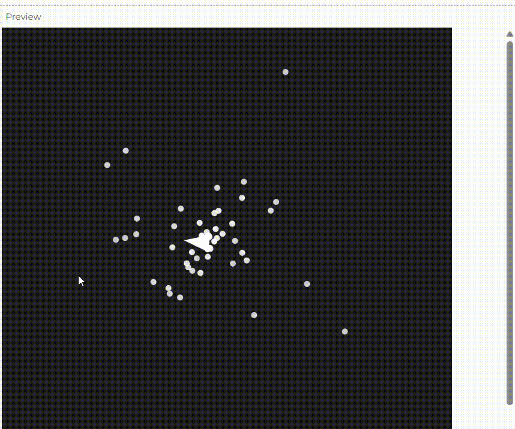

**diseña e implementa una obra de arte generativa algorítmica interactiva en tiempo real en p5.js que cumpla con los siguientes requisitos:**

**- Debes utilizar los conceptos de herencia y polimorfismo que revisaste en la fase de investigación.**

**- Debes utilizar al menos un concepto de cada una de las unidades anteriores: 4 conceptos.**

**- Debes definir cómo vas a gestionar el tiempo de vida de las partículas y la memoria.**

**- La obra debe ser interactiva en tiempo real. Puedes usar teclado, mouse, música, el micrófono, video, sensor o cualquier otro dispositivo de entrada.**

**- Documenta el proceso de creación, incluyendo la idea inicial, bocetos, experimentación con el código y el resultado final.**


mi primera idea fue que un circulo siguiera el movimiento del mouse y que el circulo atrayera un monton de particulas y que cuando el microfono captara un sonido la fuerza gravitacional se redujera entonces que las particulas se esparcieran. peero luego recorde que el microfono de mi computador no funciona entonces decidi que en vez del sonido fuera presionar la tecla espacio. ademas quise cambiar que en vez que el circulo siguiera el mouse, que se moviera en una onda sinuidal.

Pero luego cai en cuenta que aqui no tengo en cuenta la duracion de vida de las particulas y la eliminacion de espacio. entonces se me ocurrio hacer que en vez de que sea un circulo sea un triangulo y que siga el movimiento del mouse y que se rota la punta a donde se mueve. y quitale de que que con el espacio se disepercen sino que las particulas salen y salen del triangulo y luego se desaparecen cuando se acaba su vida pero siguen saliendo mas nuevas. tambien le añadi que cuando se hace clic cambia el color de las particulas que salen

**Enlace a tu obra en el editor de p5.js.**

https://editor.p5js.org/salome2607/sketches/bIsRsAJgw

**El código.**

```js
let particles = [];
let trianglePos;

function setup() {
  createCanvas(600, 600);
  trianglePos = createVector(width / 2, height / 2);
  angleMode(DEGREES);
}

function draw() {
  background(0);
  
  // Actualizar la posición del triángulo siguiendo el mouse pero con retraso
  trianglePos.x = lerp(trianglePos.x, mouseX, 0.05);
  trianglePos.y = lerp(trianglePos.y, mouseY, 0.05);

  // Dibujar el triángulo
  drawRotatingTriangle();

  // Crear nuevas partículas
  let p;
  if (random(1) > 0.5) {
    p = new CircleParticle(trianglePos.x, trianglePos.y);
  } else {
    p = new SquareParticle(trianglePos.x, trianglePos.y);
  }
  particles.push(p);

  // Actualizar y mostrar las partículas
  for (let i = particles.length - 1; i >= 0; i--) {
    let particle = particles[i];
    particle.update();
    particle.display();
    
    // Eliminar las partículas cuando su vida útil se acabe
    if (particle.isDead()) {
      particles.splice(i, 1);
    }
  }
}

function drawRotatingTriangle() {
  let angleToMouse = atan2(mouseY - trianglePos.y, mouseX - trianglePos.x);
  push();
  translate(trianglePos.x, trianglePos.y);
  rotate(angleToMouse);
  fill(255);
  noStroke();
  triangle(0, -20, -15, 20, 15, 20);
  pop();
}

// Clase base Particle
class Particle {
  constructor(x, y) {
    this.pos = createVector(x, y);
    this.vel = p5.Vector.random2D().mult(random(0.5, 2));
    this.acc = createVector(0, 0);
    this.lifespan = 255;
  }

  update() {
    // Añadir ruido de Perlin para que las partículas se muevan orgánicamente
    let noiseX = map(noise(this.pos.x * 0.01, frameCount * 0.01), 0, 1, -0.5, 0.5);
    let noiseY = map(noise(this.pos.y * 0.01, frameCount * 0.01), 0, 1, -0.5, 0.5);
    let noiseVector = createVector(noiseX, noiseY);
    this.vel.add(noiseVector);

    this.vel.add(this.acc);
    this.pos.add(this.vel);
    this.lifespan -= 2;
  }

  isDead() {
    return this.lifespan <= 0;
  }
  
  // Método display para sobrescribir en clases hijas
  display() {
    // Será sobrescrito por las subclases
  }
}

// Partícula circular
class CircleParticle extends Particle {
  display() {
    fill(255, this.lifespan);
    noStroke();
    ellipse(this.pos.x, this.pos.y, 10);
  }
}

// Partícula cuadrada
class SquareParticle extends Particle {
  display() {
    fill(255, 0, 0, this.lifespan);  // Las partículas cuadradas son rojas
    noStroke();
    rectMode(CENTER);
    rect(this.pos.x, this.pos.y, 10, 10);
  }
}
```

**Qué concepto de cada unidad aplicaste, cómo lo aplicaste y por qué.**

- Motion 101 (Fuerzas y movimiento básico):
Aplicación: El triángulo (attractor) se mueve hacia la posición del mouse utilizando un vector de dirección que apunta desde su posición actual hacia el mouse. Este vector se ajusta en magnitud con dir.setMag(0.1) para controlar la velocidad con la que el triángulo sigue el mouse. Luego, el triángulo acelera y la velocidad se limita con this.vel.limit(4) para evitar que se mueva demasiado rápido.

Por qué: Este concepto es fundamental para dar un movimiento suave y realista al triángulo. Motion 101 implica el uso de vectores para definir el movimiento, controlando la velocidad y dirección de manera gradual.

- Rotación de ángulos:
Aplicación: El triángulo rota para apuntar hacia la dirección en la que se mueve. La rotación se calcula usando atan2(this.vel.y, this.vel.x), lo que devuelve el ángulo del vector de velocidad. Este ángulo se utiliza para rotar el triángulo en el espacio.

Por qué: La rotación es necesaria para que el triángulo apunte a la dirección de movimiento, lo que mejora la coherencia visual y la sensación de que el objeto está "siguiendo" el movimiento del mouse de forma natural.

- Ruido de Perlin:
Aplicación: El movimiento de las partículas se basa en el ruido de Perlin. En lugar de un movimiento completamente aleatorio, cada partícula tiene una trayectoria suave, generada por valores de ruido Perlin para los ejes X e Y (noiseX y noiseY). Cada partícula tiene un offset aleatorio (tOffset) para que las trayectorias sean únicas y orgánicas.

Por qué: El ruido de Perlin proporciona un movimiento fluido y menos caótico, lo que es útil para simular fenómenos naturales como la dispersión de partículas. Se utilizó para dar un aspecto más suave y menos aleatorio al movimiento de las partículas.

- Emisores de partículas (Particle Emitters):
Aplicación: El triángulo actúa como un emisor de partículas. Cada cuadro, se crean nuevas partículas en la posición del triángulo, las cuales se mueven, envejecen y eventualmente desaparecen cuando su vida útil termina (this.lifespan). Las partículas tienen un ciclo de vida limitado, lo que gestiona su memoria y rendimiento.

Por qué: Los emisores de partículas son clave para crear efectos visuales dinámicos. Aquí, el triángulo emite continuamente nuevas partículas que siguen el flujo generado por el ruido de Perlin. Esto añade una sensación de movimiento constante, haciendo que el triángulo sea un emisor activo que expulsa partículas, similar a muchos efectos en simulaciones gráficas.

**Una captura de pantalla con una imagen de tu obra.**



